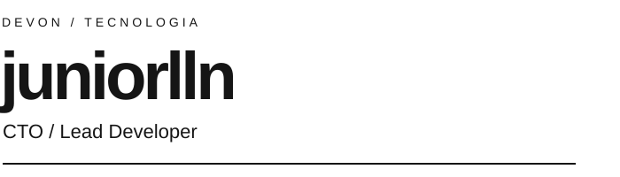
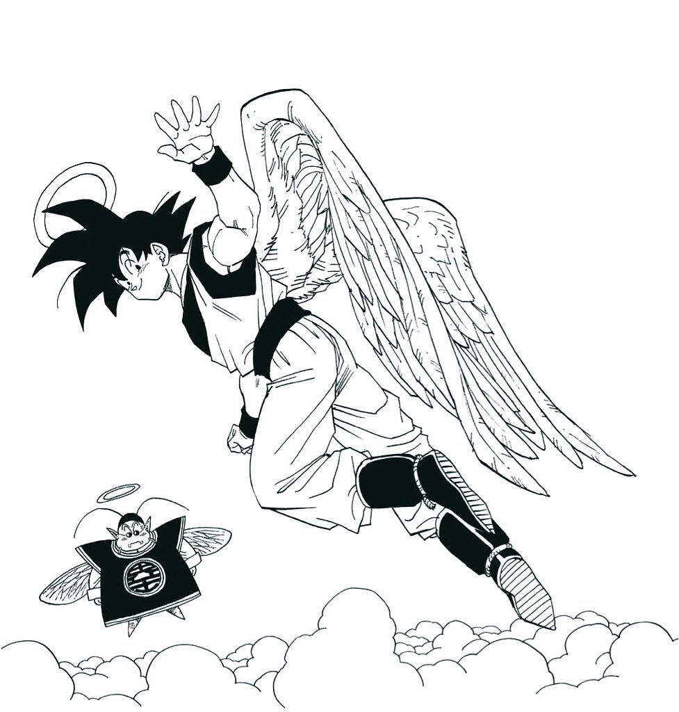
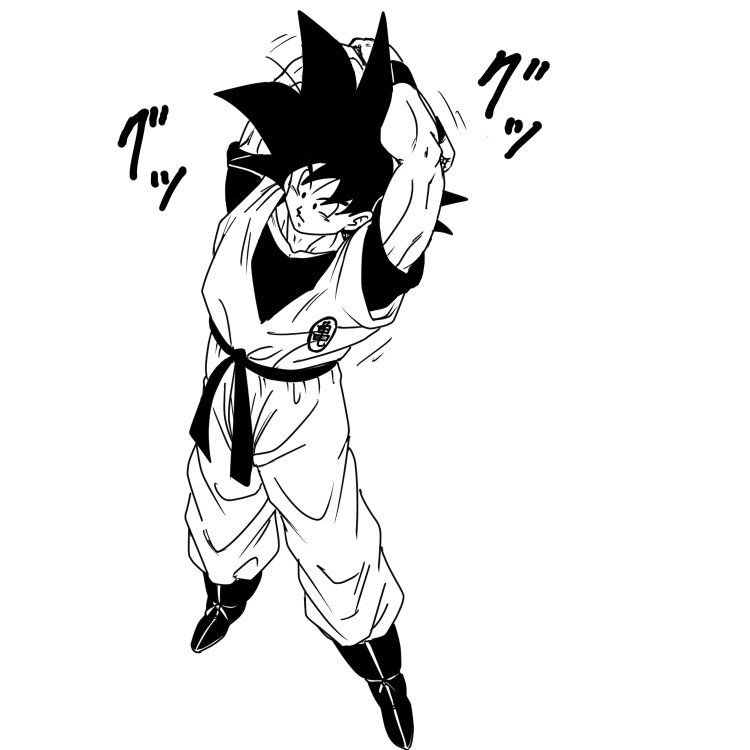
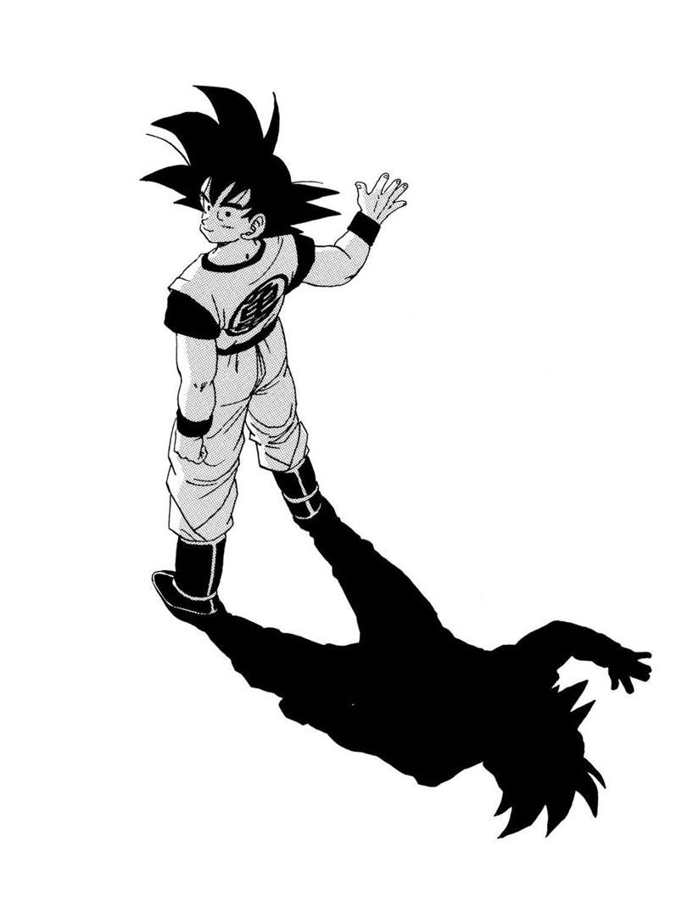

<table width="100%">
  <tr>
    <td colspan="2" width="70%" valign="top">
      
      <h3>Sobre mim</h3>
      
Trabalho na <strong>DevON</strong> como <strong>CTO / Lead Developer</strong>. Estou no começo do meu aprendizado em <strong>Python</strong>, construindo minha base em programação com estudo e prática.

      
Meu foco agora é avançar em Python, um passo de cada vez. Mais adiante, quero explorar outras linguagens.

    </td>
    <td align="right" width="30%" valign="top"></td>
  </tr>
</table>

  

<h3>Meu treinamento</h3>

<strong>Agora:</strong> primeiros passos em Python e fundamentos de programação.

<strong>Mais adiante:</strong> aprofundar meus conhecimentos e aprender outras linguagens.

<table width="100%">
  <tr>
    <td width="70%" valign="top">
      <h3>Código e evolução</h3>
      
Meus estudos e projetos ficam no <a href="https://github.com/juniorlln-oss">meu GitHub</a>. Cada novo aprendizado é mais um passo nessa jornada.

      
<a href="https://github.com/juniorlln-oss"><strong>@juniorlln-oss</strong></a>

      
Um pouco de treino todos os dias.

    </td>
    <td align="right" width="30%" valign="bottom"></td>
  </tr>
</table>

