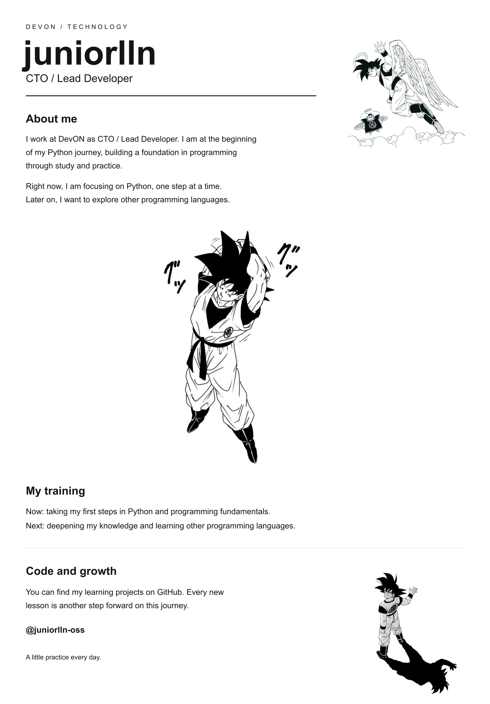

  

Read the text version

### About me

I work at **DevON** as **CTO / Lead Developer**. I am at the beginning of my **Python** journey, building a foundation in programming through study and practice.

Right now, I am focusing on Python, one step at a time. Later on, I want to explore other programming languages.

### My training

**Now:** taking my first steps in Python and programming fundamentals.

**Next:** deepening my knowledge and learning other programming languages.

### Code and growth

You can find my learning projects on [my GitHub](https://github.com/juniorlln-oss). Every new lesson is another step forward on this journey.

A little practice every day.

